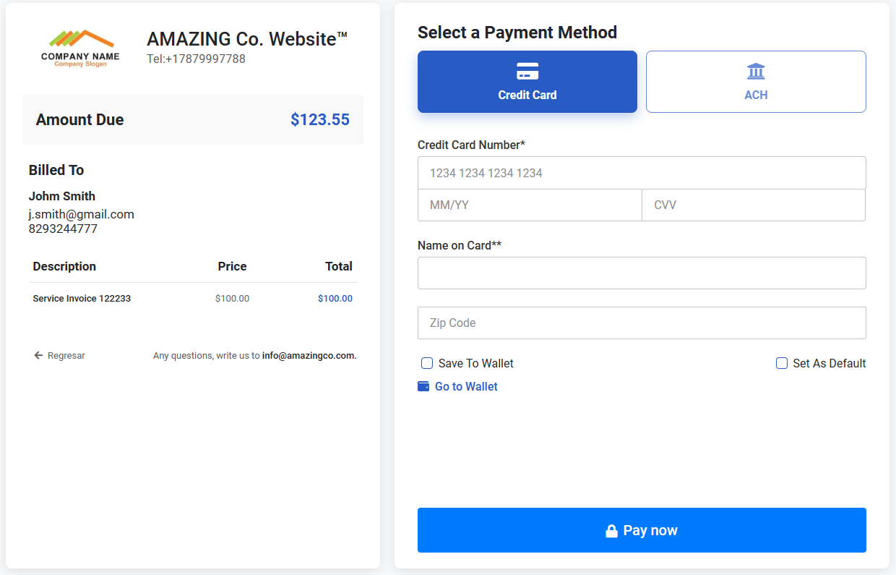
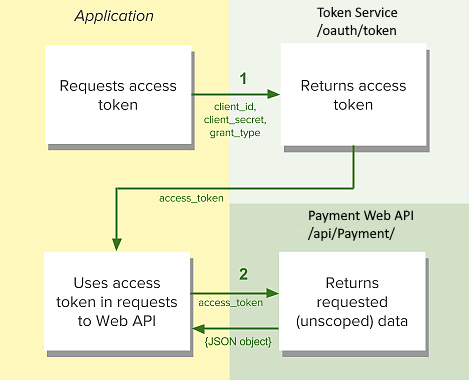

# Testshop WebPay
## Payment button integration sample

This is an example project using C# simulating a page with a payment button to send user control to the WebPay module.

The steps performed by the example are as follows
1. Request (server-side) the JWT token for authentication, using the /api/paymenttoken endpoint and sending information about the order to be carried out.
2. Prepare the payment form that will be sent to the WebPay module including the JWT token as a hidden field

The payment shows depending on the parameters sent
refer todetailed  documentation at: https://agilisa.atlassian.net/l/cp/sqhZebnK

## JWT Validation token
The objective of obtaining the JWT token from the server is to be able to validate the authenticity of the message, and prevent any payment data from being modified by the user before submitting the form. The WebPay server will validate that the JWT token information matches the fields sent for payment.

For authentication, this information must be provided to the token endpoint. 
If the provided credentials are valid, the identity provider will issue a token to the requesting application.

* **grant_type** client_credentials
* **client_id**: Uniquely identifies the client requesting the token
* **client_secret**: Password used to authenticate the token request
* **orderId**: unique order invoice/ contract
* **customerId**: unique customer identification
* **amount**: total amount of the order

Each response message will the following data:
* **access_token**: unique value that must be sent on every api call as a bearer token
* **token_type**: bearer
* **expires_in**: token expiration time
